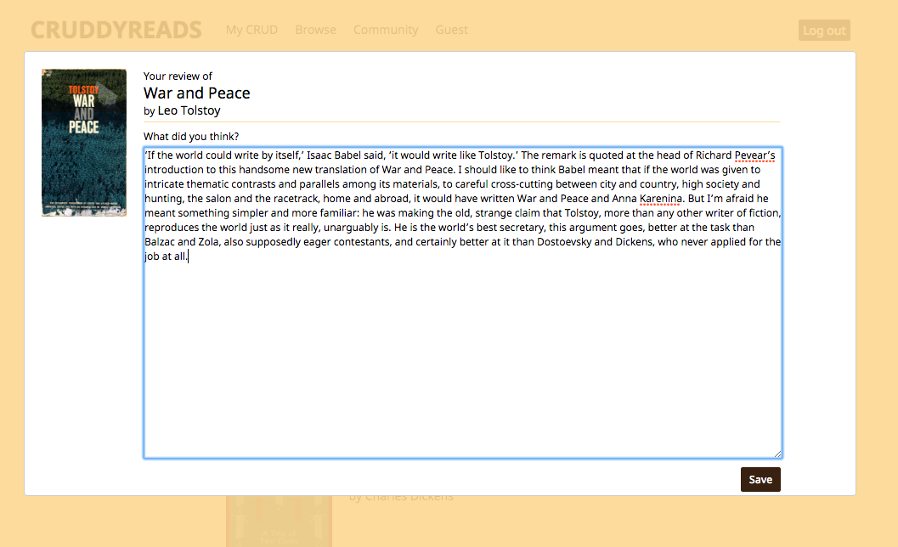
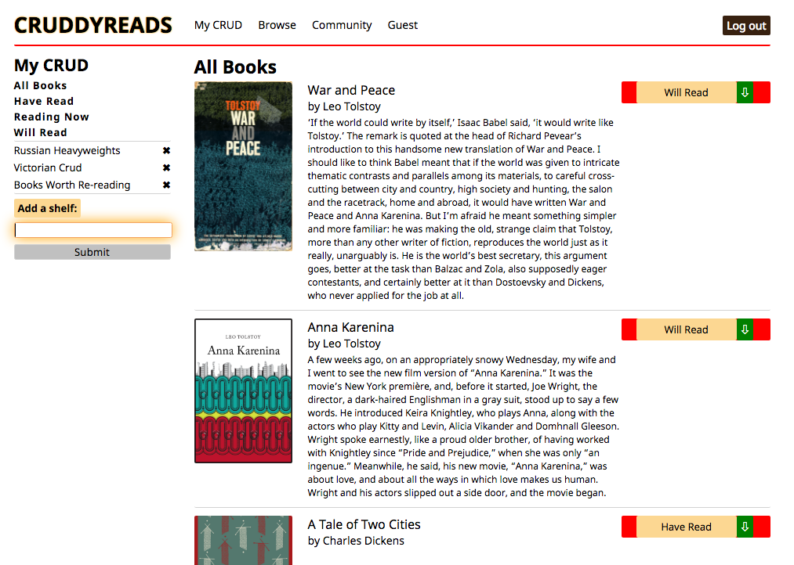

#CruddyReads

CruddyReads is a web application for keeping track of what books you and others are reading, sharing reviews, and organizing your books into virtual shelves. It was inspired by Goodreads and is built on a foundation of Ruby on Rails with React.js on the frontend.

###Landing Page:

###Browse Books:

###Add Reviews

###User Shelves

###User Readings Page:

###Technical Details:
* CruddyReads makes good use of React.js's native implementation of the Flux loop. Stores provide persistence of data within the context of React's constant, Heraclitean flux.
* OmniAuth allows users to log in through Twitter, instead of belaboring the point and writing the same credentials again for the n-th time.
* CSS (hover-overs, drop-downs, on-click changes, inter alia) and modals are used throughout to promote a smoother user experience.

###Features
* Sign up or sign in with Twitter
* Mark books as "Have read", "Currently reading", or "Will read"
* Add books to shelves of your own devising
* Browse all books in the database
* Write a review of a book you have added as a reading
* Peer into other users' collections of readings

###Languages
* Javascript
* Ruby
* HTML
* CSS

###Frameworks
* React.js
* Ruby on Rails

###Libraries and Technologies

* BCrypt
* Flux
* jQuery
* PostgreSQL
* Twitter OmniAuth
* React Router
* Webpack

###Still to come:
* [ ] Add author homepages.
* [ ] Add search functionality. Find books by title or author.
* [ ] Users' personal info pages should allow for editing, especially for updating their avatars
* [ ] View other users' readings by shelves.
